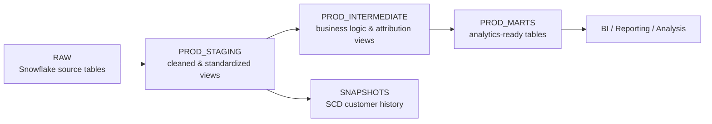

# Northwind Marketing Analytics with dbt + Snowflake + Airflow

[](https://github.com/Rahaf89/dbt_snowflake/actions/workflows/ci.yml)

A production-style analytics engineering project built with **Snowflake**, **dbt Cloud**, **Python**, and an optional **Apache Airflow** orchestration layer.

The project transforms raw customer, order, web event, and paid media data into tested analytical models for:

- marketing attribution
- channel performance
- customer lifetime value
- funnel analysis
- ad spend reporting
- customer history tracking with snapshots


> **Architecture at a glance:** Python generates reproducible sample data, Snowflake stores raw sources, dbt Cloud builds and tests the transformation layers, and Airflow is included as an optional orchestration layer for triggering the dbt Cloud production job.

## Repository Layout

```text
dbt_snowflake/
├── snowflake/
│   ├── 01_setup.sql
│   ├── 02_raw_tables.sql
│   ├── 03_key_pair_template.sql
│   └── README.md
├── ingestion/
│   ├── generate_data.py
│   └── requirements.txt
├── airflow/
│   ├── dags/
│   │   └── northwind_marketing_pipeline.py
│   ├── requirements.txt
│   └── README.md
├── docs/
│   └── architecture.svg
├── models/
│   ├── staging/
│   ├── intermediate/
│   └── marts/
├── snapshots/
├── tests/
├── dbt_project.yml
├── packages.yml
├── .gitignore
└── README.md
```

The repository keeps the Snowflake infrastructure/setup scripts and the dbt transformation project together so the full pipeline is version-controlled in one place.

## Architecture



### Snowflake production schemas

```text
NORTHWIND
├── RAW
├── PROD_STAGING
├── PROD_INTERMEDIATE
├── PROD_MARTS
└── SNAPSHOTS
```

Development is isolated from production through dbt development schemas, while scheduled production runs build into the `PROD_*` schemas.

## Tech Stack

- **Snowflake** — cloud data warehouse
- **dbt Cloud** — transformation, testing, documentation, lineage, and production job execution
- **Apache Airflow** — optional Python orchestration layer that can trigger the dbt Cloud production job
- **GitHub** — version control and deployment workflow
- **Python + Faker** — synthetic source-data generation and Airflow DAGs
- **SQL / Jinja** — transformation logic

## Project Setup — Reviewer Quick Start

A reviewer can understand or reproduce the project in a few steps:

1. **Review the architecture** in `docs/architecture.svg`.
2. **Create the Snowflake environment** with `snowflake/01_setup.sql` and `snowflake/02_raw_tables.sql`.
3. **Generate sample source data**:
   ```bash
   cd ingestion
   pip install -r requirements.txt
   python generate_data.py --out ../raw_data
   ```
4. **Load the five CSV files** from `raw_data/` into the matching tables in `NORTHWIND.RAW`. The exact Snowsight steps, table mapping, and verification queries are documented in [`snowflake/README.md`](snowflake/README.md).
5. **Configure dbt Cloud** with database `NORTHWIND`, warehouse `TRANSFORM_WH_XS`, role `TRANSFORMER`, and key-pair authentication.
6. **Build and test the dbt project**:
   ```bash
   dbt deps
   dbt source freshness
   dbt build
   ```
7. **Optional Airflow orchestration:** install `airflow/requirements.txt`, configure the `snowflake_northwind` and `dbt_cloud_default` Airflow connections, and deploy `airflow/dags/northwind_marketing_pipeline.py`.

For a quick code review, start with `models/staging/`, then `models/intermediate/`, `models/marts/`, `tests/`, and finally the Airflow DAG.

## Source Data

The project uses five raw source tables:

| Source | Purpose |
|---|---|
| `CUSTOMERS` | Customer attributes and acquisition information |
| `ORDERS` | Transactions, revenue, refunds, and order timestamps |
| `WEB_EVENTS` | Customer web activity and marketing touchpoints |
| `GOOGLE_ADS_SPEND` | Google Ads spend |
| `META_ADS_SPEND` | Meta Ads spend |

The source tables live in `NORTHWIND.RAW`.

## dbt Project Structure

```text
models/
├── staging/
│   ├── _sources.yml
│   ├── _staging.yml
│   ├── stg_ad_spend.sql
│   ├── stg_customers.sql
│   ├── stg_orders.sql
│   └── stg_web_events.sql
├── intermediate/
│   ├── int_attributed_revenue.sql
│   └── int_customer_touchpoints.sql
└── marts/
    ├── _marts.yml
    ├── fct_ad_spend.sql
    ├── mart_channel_performance.sql
    ├── mart_customer_ltv.sql
    └── mart_funnel.sql

snapshots/
└── scd_customers.sql

tests/
└── assert_spend_reconciles_to_source.sql
```

## Modeling Layers

### Staging

Production schema: `NORTHWIND.PROD_STAGING`

Models:

- `STG_CUSTOMERS`
- `STG_ORDERS`
- `STG_WEB_EVENTS`
- `STG_AD_SPEND`

### Intermediate

Production schema: `NORTHWIND.PROD_INTERMEDIATE`

Models:

- `INT_CUSTOMER_TOUCHPOINTS`
- `INT_ATTRIBUTED_REVENUE`

### Marts

Production schema: `NORTHWIND.PROD_MARTS`

Models:

- `FCT_AD_SPEND`
- `MART_CHANNEL_PERFORMANCE`
- `MART_CUSTOMER_LTV`
- `MART_FUNNEL`

## Marketing Attribution

The attribution model is configurable through dbt variables:

```yaml
vars:
  attribution_model: "linear"
  attribution_window_days: 30
```

Supported attribution approaches:

- `first_touch`
- `last_touch`
- `linear`

This allows the attribution strategy to be changed without rewriting the underlying model SQL.

## Customer Lifetime Value

`MART_CUSTOMER_LTV` calculates customer revenue during the first **90 days after the first non-refunded order**.

The model also identifies customers whose 90-day LTV window is still incomplete, allowing downstream reporting to exclude immature cohorts when necessary.

## Customer Snapshot

The project uses a dbt snapshot at:

```text
NORTHWIND.SNAPSHOTS.SCD_CUSTOMERS
```

This preserves historical customer changes using a slowly changing dimension pattern.

## Data Quality

The project includes:

- source definitions
- schema tests
- custom data tests
- source freshness checks
- reconciliation testing
- dbt build validation

The project currently includes 10 models, 5 sources, 1 snapshot, 16 data tests, and 1 exposure.

A custom test verifies that modeled advertising spend reconciles with source spend.

## Source Freshness

The `ORDERS` source uses `order_timestamp` as its freshness field.

Production orchestration runs:

```bash
dbt source freshness
dbt build
```

## Production Orchestration

A dbt Cloud production environment is connected to Snowflake using a dedicated `TRANSFORMER` role and key-pair authentication.

The production job performs:

```text
Clone Git repository
        ↓
Create Snowflake profile
        ↓
dbt deps
        ↓
dbt source freshness
        ↓
dbt build
        ↓
Generate dbt documentation
```

The production job is configured for a daily schedule at **07:00 UTC**.

## Airflow Orchestration Option

The repository includes a Python DAG at:

```text
airflow/dags/northwind_marketing_pipeline.py
```

The DAG performs three orchestration steps:

```text
Validate Snowflake RAW sources
          ↓
Trigger dbt Cloud Production Build
          ↓
Validate final PROD_MARTS tables
```

This keeps dbt Cloud responsible for transformation logic, source freshness, tests, snapshots, and documentation while Airflow coordinates the wider workflow.

**Use one production scheduler.** If Airflow owns the daily schedule, disable the schedule inside dbt Cloud to avoid duplicate runs. The example DAG is configured for `07:00 UTC`.

Airflow uses the official dbt Cloud provider's `DbtCloudRunJobOperator` to trigger the existing project/environment/job by name, and the Snowflake provider for SQL validation tasks.

## Authentication

Snowflake and dbt Cloud use **RSA key-pair authentication** in this project rather than storing the Snowflake password in dbt Cloud.

The setup is documented step-by-step in [`snowflake/README.md`](snowflake/README.md), including:

- generating the RSA private/public key pair with OpenSSL on Windows
- encrypting the private key for dbt Cloud
- choosing and storing the private-key passphrase
- registering the public key on the Snowflake user
- configuring the dbt Cloud Key pair authentication fields

No private keys or passphrases are committed to this repository.

## Snowflake Security

dbt runs with a dedicated transformation role rather than `ACCOUNTADMIN`.

The `TRANSFORMER` role has the permissions needed to:

- use the `NORTHWIND` database
- use the transformation warehouse
- read from `NORTHWIND.RAW`
- create and manage dbt output schemas

Authentication uses an encrypted RSA private key in dbt Cloud, with the corresponding public key registered on the Snowflake user.

## dbt Configuration

The project separates models by layer:

```yaml
models:
  northwind_marketing:
    staging:
      +materialized: view
      +schema: staging
    intermediate:
      +materialized: view
      +schema: intermediate
    marts:
      +materialized: table
      +schema: marts
```

With `PROD` as the production base schema, dbt generates:

```text
PROD_STAGING
PROD_INTERMEDIATE
PROD_MARTS
```

## Running the Project

Install dependencies:

```bash
dbt deps
```

Build all models, snapshots, and tests:

```bash
dbt build
```

Build only the staging layer:

```bash
dbt build --select staging
```

Run source freshness checks:

```bash
dbt source freshness
```

Clean generated artifacts:

```bash
dbt clean
```

## Example Analytical Questions

This project supports questions such as:

1. Which marketing channels generate the most attributed revenue?
2. How does ad spend compare with attributed revenue by channel?
3. Where do customers drop out of the marketing funnel?
4. What is 90-day customer lifetime value by acquisition channel and cohort?
5. How do first-touch, last-touch, and linear attribution change channel performance?

## Continuous Integration

Pull requests to `main` and pushes to `main` run the GitHub Actions workflow in:

```text
.github/workflows/ci.yml
```

The CI job checks the repository before changes are merged:

1. checks out the repository
2. installs Python 3.12
3. installs dbt Core, the Snowflake adapter, and PyYAML
4. compiles the Python ingestion and Airflow DAG files to catch syntax errors
5. parses every YAML file to catch invalid configuration
6. runs `dbt deps`
7. runs `dbt parse` with a safe dummy CI profile, so dbt/Jinja/ref/source errors are caught without connecting to Snowflake
8. verifies that the core project files are still present

The CI profile is intentionally stored under `.github/ci/profiles.yml` and contains only dummy connection values. No production Snowflake credentials are required for these checks.

A failed check gives the pull request a red status; a successful check gives it a green status. This is the first safety gate before code is merged and later deployed by the dbt Cloud production job.

## Development Workflow

```text
Feature branch
      ↓
dbt Cloud Studio
      ↓
dbt build + tests
      ↓
Pull request
      ↓
Merge to main
      ↓
Production dbt Cloud job
      ↓
Snowflake PROD_* schemas
```

## Project Highlights

- Layered dbt architecture
- Separate development and production schemas
- Configurable marketing attribution
- Source freshness monitoring
- Automated dbt tests
- Custom reconciliation test
- SCD snapshot implementation
- Snowflake key-pair authentication
- Dedicated transformation role
- Git-based deployment
- Scheduled dbt Cloud production job
- Optional Apache Airflow DAG for cross-system orchestration
- Python synthetic-data generator
- Architecture diagram for reviewers
- Generated dbt documentation and lineage

## Future Improvements

- add CI jobs for pull requests
- deploy the included Airflow DAG in a managed Airflow environment
- add incremental models for large event tables
- expose marts to Looker or another BI tool
- add anomaly detection for spend and conversion metrics
- create dbt Semantic Layer metrics
- add warehouse cost monitoring and query optimization
- add alerting for failed production runs or freshness failures
