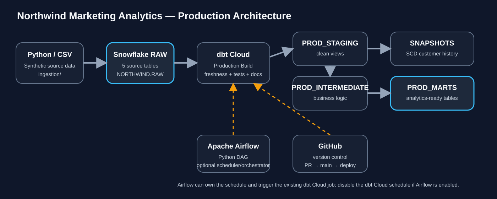
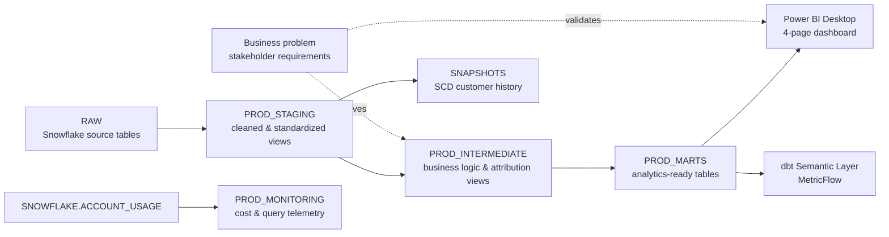

# Northwind Marketing Analytics with dbt + Snowflake + Power BI

[](https://github.com/Rahaf89/dbt_snowflake/actions/workflows/ci.yml)

A production-style analytics engineering project built with **Snowflake**, **dbt Cloud**, **Power BI Desktop**, **Python**, and an optional **Apache Airflow** orchestration layer.

The project transforms raw customer, order, web event, and paid media data into tested analytical models for:

- marketing attribution
- channel performance
- customer lifetime value
- funnel analysis
- ad spend reporting
- customer history tracking with snapshots



> **Architecture at a glance:** Python generates reproducible sample data, Snowflake stores raw sources, dbt Cloud builds and tests the transformation layers, the dbt Semantic Layer governs business metrics, and Power BI Desktop consumes the production marts for a four-page portfolio dashboard. Airflow remains an optional orchestration layer.

## Repository Layout

```text
dbt_snowflake/
├── snowflake/
│   ├── 01_setup.sql
│   ├── 02_raw_tables.sql
│   ├── 03_key_pair_template.sql
│   ├── 04_monitoring_grants.sql
│   └── README.md
├── ingestion/
│   ├── generate_data.py
│   └── requirements.txt
├── airflow/
│   ├── dags/
│   │   └── northwind_marketing_pipeline.py
│   ├── requirements.txt
│   └── README.md
├── docs/
│   ├── architecture.svg
│   ├── alerting.md
│   ├── anomaly_detection.md
│   ├── semantic_layer.md
│   ├── business_requirements.md
│   └── power_bi_dashboard.md
├── models/
│   ├── staging/
│   ├── intermediate/
│   ├── marts/
│   └── monitoring/
├── snapshots/
├── tests/
├── dbt_project.yml
├── packages.yml
├── .gitignore
└── README.md
```

The repository keeps the Snowflake infrastructure/setup scripts and the dbt transformation project together so the full pipeline is version-controlled in one place.

## Business Problem & Requirements

This project is designed as a **requirements-driven analytics delivery**, not just a dashboard exercise.

The simulated client scenario starts with a marketing organization that has customer, order, web-event, Google Ads, and Meta Ads data but cannot reliably answer core questions about channel performance, attribution, funnel conversion, customer value, and marketing efficiency.

The requirements were translated into explicit deliverables:

| Business requirement | Delivered solution |
|---|---|
| Executive view of revenue, spend, ROAS, CAC, orders, and new customers | `MART_CHANNEL_PERFORMANCE` + Executive Summary |
| Configurable first-touch / last-touch / linear attribution | attribution intermediate models + Marketing Attribution page |
| Funnel analysis from session → add-to-cart → purchase | `MART_FUNNEL` + Funnel Analysis |
| 90-day customer value by cohort and acquisition channel | `MART_CUSTOMER_LTV` + Customer LTV page |
| Consistent KPI definitions | dbt Semantic Layer / MetricFlow |
| Trusted, production-ready data | dbt tests, freshness, snapshots, monitoring, CI/CD |
| Scalable event processing | incremental `STG_WEB_EVENTS` |
| Secure production deployment | Snowflake roles, RSA key-pair auth, dbt Cloud deployment |

The complete stakeholder brief, business questions, requirements, acceptance criteria, scope decisions, and requirement-to-deliverable traceability are documented in:

**[Business Problem & Requirements](docs/business_requirements.md)**

This creates the full portfolio story:

```text
client/business problem
        ↓
requirements gathering
        ↓
metric + data definitions
        ↓
Snowflake + dbt implementation
        ↓
testing / monitoring / deployment
        ↓
Semantic Layer
        ↓
Power BI dashboard
        ↓
business validation
```

## Architecture



### Snowflake production schemas

```text
NORTHWIND
├── RAW
├── PROD_STAGING
├── PROD_INTERMEDIATE
├── PROD_MARTS
├── PROD_MONITORING
└── SNAPSHOTS
```

Development is isolated from production through dbt development schemas, while scheduled production runs build into the `PROD_*` schemas.

## Tech Stack

- **Snowflake** — cloud data warehouse
- **dbt Cloud** — transformation, testing, documentation, lineage, and production job execution
- **Power BI Desktop** — portfolio dashboard and interactive reporting on the production marts
- **Apache Airflow** — optional Python orchestration layer that can trigger the dbt Cloud production job
- **GitHub** — version control and deployment workflow
- **Python + Faker** — synthetic source-data generation and Airflow DAGs
- **SQL / Jinja** — transformation logic

## Project Setup — Reviewer Quick Start

A reviewer can understand or reproduce the project in a few steps:

1. **Start with the business problem and requirements** in [`docs/business_requirements.md`](docs/business_requirements.md).
2. **Review the architecture** in `docs/architecture.svg`.
3. **Create the Snowflake environment** with `snowflake/01_setup.sql` and `snowflake/02_raw_tables.sql`.
4. **Generate sample source data**:
   ```bash
   cd ingestion
   pip install -r requirements.txt
   python generate_data.py --out ../raw_data
   ```
5. **Load the five CSV files** from `raw_data/` into the matching tables in `NORTHWIND.RAW`. The exact Snowsight steps, table mapping, and verification queries are documented in [`snowflake/README.md`](snowflake/README.md).
6. **Configure dbt Cloud** with database `NORTHWIND`, warehouse `TRANSFORM_WH_XS`, role `TRANSFORMER`, and key-pair authentication.
7. **Build and test the dbt project**:
   ```bash
   dbt deps
   dbt source freshness
   dbt build
   ```
8. **Review the Power BI dashboard** in [`docs/power_bi_dashboard.md`](docs/power_bi_dashboard.md), including screenshots, the PDF export, and the versioned `.pbix` portfolio artifact.
9. **Optional Airflow orchestration:** install `airflow/requirements.txt`, configure the `snowflake_northwind` and `dbt_cloud_default` Airflow connections, and deploy `airflow/dags/northwind_marketing_pipeline.py`.

For a quick code review, start with `models/staging/`, then `models/intermediate/`, `models/marts/`, `tests/`, and finally the Airflow DAG.

## Source Data

The project uses five raw source tables:

| Source | Purpose |
|---|---|
| `CUSTOMERS` | Customer attributes and acquisition information |
| `ORDERS` | Transactions, revenue, refunds, and order timestamps |
| `WEB_EVENTS` | Customer web activity and marketing touchpoints |
| `GOOGLE_ADS_SPEND` | Google Ads spend |
| `META_ADS_SPEND` | Meta Ads spend |

The source tables live in `NORTHWIND.RAW`.

## dbt Project Structure

```text
models/
├── staging/
│   ├── _sources.yml
│   ├── _staging.yml
│   ├── stg_ad_spend.sql
│   ├── stg_customers.sql
│   ├── stg_orders.sql
│   └── stg_web_events.sql
├── intermediate/
│   ├── int_attributed_revenue.sql
│   └── int_customer_touchpoints.sql
├── marts/
│   ├── _marts.yml
│   ├── _time_spine.yml
│   ├── time_spine_daily.sql
│   ├── fct_ad_spend.sql
│   ├── mart_channel_performance.sql
│   ├── mart_customer_ltv.sql
│   └── mart_funnel.sql
└── monitoring/
    ├── _monitoring_sources.yml
    ├── _monitoring.yml
    ├── mon_warehouse_daily_usage.sql
    ├── mon_query_performance.sql
    ├── mon_marketing_daily_metrics.sql
    └── mon_marketing_anomalies.sql

snapshots/
└── scd_customers.sql

tests/
└── assert_spend_reconciles_to_source.sql
```

## Modeling Layers

### Staging

Production schema: `NORTHWIND.PROD_STAGING`

Models:

- `STG_CUSTOMERS`
- `STG_ORDERS`
- `STG_WEB_EVENTS`
- `STG_AD_SPEND`

### Intermediate

Production schema: `NORTHWIND.PROD_INTERMEDIATE`

Models:

- `INT_CUSTOMER_TOUCHPOINTS`
- `INT_ATTRIBUTED_REVENUE`

### Marts

Production schema: `NORTHWIND.PROD_MARTS`

Models:

- `FCT_AD_SPEND`
- `MART_CHANNEL_PERFORMANCE`
- `MART_CUSTOMER_LTV`
- `MART_FUNNEL`

## Incremental Event Processing

`STG_WEB_EVENTS` is materialized as an **incremental Snowflake table** because event data is the natural high-volume source in this project.

The model uses:

```text
materialization: incremental
strategy:        merge
unique key:      event_id
lookback window: 3 days
```

On the first run, dbt builds the complete table. On later runs, it only rereads recent rows from `NORTHWIND.RAW.WEB_EVENTS` and merges them into the existing staging table.

The lookback window is configurable in `dbt_project.yml`:

```yaml
vars:
  event_lookback_days: 3
```

Why use a lookback instead of only loading events newer than the current maximum timestamp? Real event pipelines can receive **late-arriving data**. Reprocessing the most recent few days allows those late records to be captured, while `event_id` prevents duplicates.

To deliberately rebuild the incremental model from scratch:

```bash
dbt build --select stg_web_events+ --full-refresh
```

This pattern reduces the amount of source data scanned as the event table grows while keeping the logic safe for late arrivals.

## Snowflake Cost & Query Monitoring

The project includes a dedicated dbt monitoring layer backed by Snowflake's `SNOWFLAKE.ACCOUNT_USAGE` metadata.

Production schema:

```text
NORTHWIND.PROD_MONITORING
```

Models:

- `MON_WAREHOUSE_DAILY_USAGE` — daily warehouse credit consumption and an estimate of compute credits spent while no query was actively executing.
- `MON_QUERY_PERFORMANCE` — query execution telemetry for identifying long-running and high-scan queries.

The monitoring window and warehouse are configurable in `dbt_project.yml`:

```yaml
vars:
  monitoring_lookback_days: 30
  monitored_warehouse: "TRANSFORM_WH_XS"
```

Before dbt can build these models, run this once in Snowflake using `ACCOUNTADMIN`:

```sql
GRANT DATABASE ROLE SNOWFLAKE.USAGE_VIEWER TO ROLE TRANSFORMER;
```

The repository includes the same grant in:

```text
snowflake/04_monitoring_grants.sql
```

The grant is read-only access to Snowflake historical usage metadata. It does not give the `TRANSFORMER` role permission to resize, suspend, resume, or otherwise administer warehouses.

### Monitoring warehouse efficiency

Example:

```sql
SELECT
    usage_date,
    warehouse_name,
    compute_credits,
    query_attributed_credits,
    estimated_idle_credits,
    estimated_idle_pct
FROM NORTHWIND.PROD_MONITORING.MON_WAREHOUSE_DAILY_USAGE
ORDER BY usage_date DESC;
```

`estimated_idle_credits` is calculated as compute credits minus credits Snowflake attributes to query execution. It is an operational efficiency indicator, not a final invoice amount.

### Finding expensive queries

Example:

```sql
SELECT
    query_id,
    user_name,
    role_name,
    total_elapsed_seconds,
    gb_scanned,
    cache_hit_pct,
    start_time
FROM NORTHWIND.PROD_MONITORING.MON_QUERY_PERFORMANCE
ORDER BY total_elapsed_seconds DESC
LIMIT 20;
```

This makes it easier to investigate queries that run for a long time, scan large amounts of data, or make poor use of warehouse cache.

The monitoring models deliberately do **not** persist raw `QUERY_TEXT`, because SQL text can sometimes contain sensitive literals.

Snowflake `ACCOUNT_USAGE` is historical telemetry rather than real-time monitoring, so recent activity can appear with a delay.

### Testing and validating the monitoring layer

Use this sequence after adding or changing the monitoring models.

**1. Grant read-only Account Usage access**

Run once in Snowflake:

```sql
USE ROLE ACCOUNTADMIN;

GRANT DATABASE ROLE SNOWFLAKE.USAGE_VIEWER
TO ROLE TRANSFORMER;
```

**2. Validate in the dbt development environment**

Run:

```bash
dbt build --select monitoring
```

A successful run means both monitoring models compile and execute with the configured Snowflake connection and their dbt schema tests pass.

**3. Validate the pull request**

Before merge, confirm the GitHub Actions CI check is green. CI validates Python/YAML, installs dbt packages, and runs `dbt parse` without using production Snowflake credentials.

**4. Merge to `main` and run the dbt Cloud Production Build**

The production job should create:

```text
NORTHWIND.PROD_MONITORING.MON_WAREHOUSE_DAILY_USAGE
NORTHWIND.PROD_MONITORING.MON_QUERY_PERFORMANCE
```

**5. Confirm the production schema and views**

Run in Snowflake:

```sql
SHOW SCHEMAS IN DATABASE NORTHWIND;

SHOW VIEWS IN SCHEMA NORTHWIND.PROD_MONITORING;
```

You should see the `PROD_MONITORING` schema and both monitoring views.

**6. Validate warehouse-usage data**

```sql
SELECT
    usage_date,
    warehouse_name,
    credits_used,
    compute_credits,
    query_attributed_credits,
    estimated_idle_credits,
    estimated_idle_pct
FROM NORTHWIND.PROD_MONITORING.MON_WAREHOUSE_DAILY_USAGE
ORDER BY usage_date DESC;
```

Check that credit values are non-negative and that the configured warehouse is `TRANSFORM_WH_XS`.

**7. Validate query-performance data**

```sql
SELECT
    query_id,
    warehouse_name,
    total_elapsed_seconds,
    gb_scanned,
    cache_hit_pct,
    start_time
FROM NORTHWIND.PROD_MONITORING.MON_QUERY_PERFORMANCE
ORDER BY start_time DESC
LIMIT 20;
```

Check that query IDs are populated, elapsed time and bytes scanned are non-negative, and rows are associated with the monitored warehouse.

**8. Interpret empty or delayed results correctly**

An empty or incomplete recent window does not automatically mean the models are broken. `SNOWFLAKE.ACCOUNT_USAGE` is delayed, so newly executed queries and recent warehouse consumption can appear later.

This validation path was used for the project: development build → PR CI → merge to `main` → production build → Snowflake schema/view checks → monitoring data checks.

## Marketing Anomaly Detection

The monitoring layer includes rolling anomaly detection for the three operational marketing signals most likely to need investigation:

- daily paid-media spend
- daily attributed revenue
- daily conversion rate

The pipeline is:

```text
FCT_AD_SPEND + INT_ATTRIBUTED_REVENUE + MART_FUNNEL
                         ↓
            MON_MARKETING_DAILY_METRICS
                         ↓
       28-period rolling baseline per channel
                         ↓
          rolling mean + standard deviation
                         ↓
                    z-score
                         ↓
             MON_MARKETING_ANOMALIES
```

The defaults are configurable in `dbt_project.yml`:

```yaml
vars:
  anomaly_lookback_periods: 28
  anomaly_min_history_periods: 7
  anomaly_zscore_threshold: 3.0
```

The rolling baseline excludes the current observation, so today's value is compared with prior history rather than influencing its own baseline. A metric is only evaluated after the configured minimum amount of history exists and its historical standard deviation is greater than zero.

The model produces individual flags for spend, attributed revenue, and conversion rate plus a combined `is_any_anomaly` flag.

A warning-level dbt test, `warn_on_marketing_anomalies.sql`, surfaces detected anomalies during `dbt build` without failing the production pipeline. This is useful for a portfolio/demo dataset where unusual synthetic values should be investigated but should not automatically block every deployment.

Full implementation and validation steps are documented in [`docs/anomaly_detection.md`](docs/anomaly_detection.md).

## dbt Semantic Layer

The project defines centrally governed business metrics with the dbt Semantic Layer / MetricFlow. The semantic definitions live in version control alongside the marts, while dbt Cloud's Semantic Layer service is configured to use the **Production** deployment environment.

Business-facing metrics include:

```text
ad_spend
attributed_revenue
roas
new_customers
cac
sessions
purchases
conversion_rate
average_90d_ltv
```

Key definitions:

```text
ROAS            = attributed_revenue / ad_spend
CAC             = ad_spend / new_customers
conversion_rate = purchases / sessions
average_90d_ltv = average customer revenue in the first 90 days
```

The project also includes:

```text
models/marts/time_spine_daily.sql
models/marts/_time_spine.yml
```

because MetricFlow requires a daily-or-finer time spine for time-based metrics. The channel/month and channel/day semantic models use explicit surrogate-key primary entities (`channel_month_key` and `channel_day_key`) so their grain is unambiguous.

### Semantic Layer setup in dbt Cloud

After the semantic models are merged and the normal **Production Build** succeeds:

```text
Account settings
    ↓
Projects
    ↓
NORTHWIND ANALYTICS
    ↓
Semantic Layer
    ↓
select deployment environment = Production
```

Then create a Semantic Layer Snowflake credential under **Credentials & tokens**.

For this project the credential uses:

```text
Username:   RAHAF
Role:       TRANSFORMER
Warehouse:  TRANSFORM_WH_XS
Auth:       Snowflake key-pair authentication
```

The Semantic Layer credential uses an encrypted RSA private key and its passphrase. A dedicated public key can be registered on the Snowflake user as `RSA_PUBLIC_KEY_2` so the existing dbt Cloud production key does not need to be replaced.

The service token is mapped with:

```text
Semantic Layer Only
Metadata Only
Environment write access: None
```

No private key, passphrase, or service-token value is committed to GitHub.

### Validation flow used in this project

Before merge:

```bash
dbt run --select time_spine_daily
dbt parse
```

After merge and a successful Production Build:

```bash
dbt sl validate
dbt sl list metrics
dbt sl query --metrics attributed_revenue,ad_spend,roas --group-by metric_time__month,channel
```

If `dbt sl validate` returns **Empty semantic manifest**, the Semantic Layer service has not yet been configured against a deployment environment containing the semantic manifest. Select **Production**, configure the Snowflake credential/service token, rerun the Production Build, and validate again.

If validation reports missing physical columns such as `PERFORMANCE_MONTH`, `FUNNEL_DATE`, `CHANNEL_MONTH_KEY`, or `CHANNEL_DAY_KEY`, verify the production marts in Snowflake and rerun the Production Build so the published manifest and warehouse relations are aligned.

The dbt Cloud Studio **Defer to: DEV** selector is a development-state setting and does not need to be changed to Production for the Semantic Layer. Production selection is done in the Semantic Layer configuration itself.

This project has now been validated successfully end to end: `dbt sl validate` passes, `dbt sl list metrics` returns the metric catalog, and Semantic Layer metric queries execute successfully against Snowflake.

Full setup, key-pair instructions, service-token setup, troubleshooting, and validation are documented in [`docs/semantic_layer.md`](docs/semantic_layer.md).

## Power BI Dashboard

The project includes a completed **Power BI Desktop** portfolio dashboard built on the Snowflake production marts.

The report contains four pages:

```text
Executive Summary
Marketing Attribution
Funnel Analysis
Customer LTV
```

Power BI connects to:

```text
NORTHWIND.PROD_MARTS.MART_CHANNEL_PERFORMANCE
NORTHWIND.PROD_MARTS.MART_FUNNEL
NORTHWIND.PROD_MARTS.MART_CUSTOMER_LTV
NORTHWIND.PROD_MARTS.FCT_AD_SPEND
```

The report includes KPI cards, channel and date slicers, revenue-versus-spend analysis, linear-attribution views, funnel conversion analysis, and 90-day LTV/cohort reporting.

The report is currently maintained in **Power BI Desktop**. It is not published to Power BI Service because the available Microsoft account does not provide an organizational Power BI tenant.

Portfolio artifacts are stored under `docs/power_bi/`:

- [Power BI report (.pbix)](docs/power_bi/Northwind_Marketing_Analytics.pbix)
- [PDF dashboard export](docs/power_bi/Northwind_Marketing_Analytics.pdf)
- dashboard screenshots for all four report pages


Full dashboard design, source mapping, measures, screenshots, validation, and artifact notes are documented in [`docs/power_bi_dashboard.md`](docs/power_bi_dashboard.md).

## Marketing Attribution

The attribution model is configurable through dbt variables:

```yaml
vars:
  attribution_model: "linear"
  attribution_window_days: 30
```

Supported attribution approaches:

- `first_touch`
- `last_touch`
- `linear`

This allows the attribution strategy to be changed without rewriting the underlying model SQL.

## Customer Lifetime Value

`MART_CUSTOMER_LTV` calculates customer revenue during the first **90 days after the first non-refunded order**.

The model also identifies customers whose 90-day LTV window is still incomplete, allowing downstream reporting to exclude immature cohorts when necessary.

## Customer Snapshot

The project uses a dbt snapshot at:

```text
NORTHWIND.SNAPSHOTS.SCD_CUSTOMERS
```

This preserves historical customer changes using a slowly changing dimension pattern.

## Data Quality

The project includes:

- source definitions
- schema tests
- custom data tests
- source freshness checks
- reconciliation testing
- dbt build validation

The project includes staging, intermediate, mart, monitoring, time-spine, snapshot, custom-test, Semantic Layer, and dashboard-exposure resources. Counts are intentionally not hard-coded here so the README does not become stale as the project evolves.

A custom test verifies that modeled advertising spend reconciles with source spend.

## Source Freshness

The `ORDERS` source uses `order_timestamp` as its freshness field.

Production orchestration runs:

```bash
dbt source freshness
dbt build
```

## Production Alerting

dbt Cloud is currently the production scheduler, so failed-run and freshness alerts are configured around the existing **Production Build** job.

The production sequence is:

```text
dbt source freshness
        ↓
dbt build
        ↓
success / failure status
        ↓
dbt Cloud notification
        ↓
email or Slack recipient
```

The important design choice is that `dbt source freshness` remains an explicit production job step. If a source exceeds its configured `error_after` threshold, the freshness step fails and the same production-job failure notification path is used.

For this static portfolio dataset, the `ORDERS` freshness thresholds are intentionally wide (`warn_after: 400 days`, `error_after: 800 days`). A real daily-ingestion pipeline should use an SLA appropriate to the source.

### Safe alert-delivery test

The repository includes:

```text
macros/simulate_alert_failure.sql
```

For notification testing, create a temporary dbt Cloud job and run:

```bash
dbt run-operation simulate_alert_failure --vars '{allow_alert_test: true}'
```

This intentionally fails the temporary job without changing Snowflake data. The expected result is a failed dbt Cloud run followed by the configured email or Slack notification.

Do not add this command to the normal Production Build. Delete or disable the temporary alert-test job after delivery is verified.

The complete setup, testing, validation, and future Airflow handoff are documented in [`docs/alerting.md`](docs/alerting.md).

## Production Orchestration

A dbt Cloud production environment is connected to Snowflake using a dedicated `TRANSFORMER` role and key-pair authentication.

The production job performs:

```text
Clone Git repository
        ↓
Create Snowflake profile
        ↓
dbt deps
        ↓
dbt source freshness
        ↓
dbt build
        ↓
Generate dbt documentation
```

The production job is configured for a daily schedule at **07:00 UTC**.

## Airflow Orchestration Option

The repository includes a Python DAG at:

```text
airflow/dags/northwind_marketing_pipeline.py
```

The DAG performs three orchestration steps:

```text
Validate Snowflake RAW sources
          ↓
Trigger dbt Cloud Production Build
          ↓
Validate final PROD_MARTS tables
```

This keeps dbt Cloud responsible for transformation logic, source freshness, tests, snapshots, and documentation while Airflow coordinates the wider workflow.

**Use one production scheduler.** If Airflow owns the daily schedule, disable the schedule inside dbt Cloud to avoid duplicate runs. The example DAG is configured for `07:00 UTC`.

Airflow uses the official dbt Cloud provider's `DbtCloudRunJobOperator` to trigger the existing project/environment/job by name, and the Snowflake provider for SQL validation tasks.

## Authentication

Snowflake and dbt Cloud use **RSA key-pair authentication** in this project rather than storing the Snowflake password in dbt Cloud.

The setup is documented step-by-step in [`snowflake/README.md`](snowflake/README.md), including:

- generating the RSA private/public key pair with OpenSSL on Windows
- encrypting the private key for dbt Cloud
- choosing and storing the private-key passphrase
- registering the public key on the Snowflake user
- configuring the dbt Cloud Key pair authentication fields

No private keys or passphrases are committed to this repository.

## Snowflake Security

dbt runs with a dedicated transformation role rather than `ACCOUNTADMIN`.

The `TRANSFORMER` role has the permissions needed to:

- use the `NORTHWIND` database
- use the transformation warehouse
- read from `NORTHWIND.RAW`
- create and manage dbt output schemas

Authentication uses an encrypted RSA private key in dbt Cloud, with the corresponding public key registered on the Snowflake user.

## dbt Configuration

The project separates models by layer:

```yaml
models:
  northwind_marketing:
    staging:
      +materialized: view
      +schema: staging
    intermediate:
      +materialized: view
      +schema: intermediate
    marts:
      +materialized: table
      +schema: marts
    monitoring:
      +materialized: view
      +schema: monitoring
```

With `PROD` as the production base schema, dbt generates:

```text
PROD_STAGING
PROD_INTERMEDIATE
PROD_MARTS
PROD_MONITORING
```

## Running the Project

Install dependencies:

```bash
dbt deps
```

Build all models, snapshots, and tests:

```bash
dbt build
```

Build only the staging layer:

```bash
dbt build --select staging
```

Run source freshness checks:

```bash
dbt source freshness
```

Clean generated artifacts:

```bash
dbt clean
```

## Example Analytical Questions

This project supports questions such as:

1. Which marketing channels generate the most attributed revenue?
2. How does ad spend compare with attributed revenue by channel?
3. Where do customers drop out of the marketing funnel?
4. What is 90-day customer lifetime value by acquisition channel and cohort?
5. How does channel performance change when the configurable attribution model is switched between first-touch, last-touch, and linear?

## CI/CD — How This Repository Deploys Changes

This project separates **CI (Continuous Integration)** from **CD (Continuous Delivery/Deployment)**.

### CI: GitHub Actions validates every change

The CI workflow is defined in:

```text
.github/workflows/ci.yml
```

It runs automatically when:

```text
a pull request targets main
or
a commit is pushed to main
```

The workflow uses an Ubuntu GitHub Actions runner and performs these checks in order:

```text
Checkout repository
      ↓
Set up Python 3.12
      ↓
Install dbt-core + dbt-snowflake + PyYAML
      ↓
Compile Python files
      ↓
Validate YAML files
      ↓
dbt deps
      ↓
dbt parse
      ↓
Check required repository structure
```

These checks catch problems such as Python syntax errors, broken YAML, missing dbt packages, invalid Jinja, broken `ref()` / `source()` relationships, and accidentally deleted core project files before code is merged.

### Why CI does not need Snowflake credentials

CI uses:

```text
.github/ci/profiles.yml
```

This profile contains **dummy Snowflake connection values**. The workflow runs `dbt parse`, not `dbt run` or `dbt build`, so it validates the dbt project without opening a real Snowflake connection.

That means no Snowflake password, RSA private key, private-key passphrase, or dbt Cloud token is stored in GitHub for this CI workflow.

### PR quality gate

A normal change follows this path:

```text
feature branch
      ↓
open Pull Request
      ↓
GitHub Actions CI runs
      ↓
green CI = code can be reviewed/merged
red CI   = fix the branch and CI runs again
      ↓
merge into main
```

The incremental `WEB_EVENTS` change in PR #2 is an example of this workflow: the model change was made on a feature branch, CI validated it, and it is merged only after the CI check passes.

### CD: dbt Cloud deploys `main` to Snowflake

GitHub Actions is the **CI layer**. The production deployment is handled by the existing **dbt Cloud Production Build** job.

After a pull request is merged:

```text
Pull Request merged
        ↓
GitHub main updated
        ↓
dbt Cloud Production Build checks out main
        ↓
dbt deps
        ↓
dbt source freshness
        ↓
dbt build
        ↓
tests + snapshots
        ↓
generate dbt docs
        ↓
Snowflake PROD_* schemas updated
```

The production job uses the Snowflake `TRANSFORMER` role and key-pair authentication documented in [`snowflake/README.md`](snowflake/README.md).

At the moment, dbt Cloud owns the production schedule. The optional Airflow DAG can later become the scheduler/orchestrator; if Airflow is enabled for scheduling, the dbt Cloud schedule should be disabled to avoid duplicate runs.

### Why use two systems?

- **GitHub Actions CI** answers: *Is this code structurally safe to merge?*
- **dbt Cloud production job** answers: *Can this code actually build and test the production analytics models in Snowflake?*

This keeps lightweight validation fast and credential-free while production execution remains inside the platform that already owns the dbt/Snowflake connection.

## Continuous Integration

Pull requests to `main` and pushes to `main` run the GitHub Actions workflow in:

```text
.github/workflows/ci.yml
```

The CI job checks the repository before changes are merged:

1. checks out the repository
2. installs Python 3.12
3. installs dbt Core, the Snowflake adapter, and PyYAML
4. compiles the Python ingestion and Airflow DAG files to catch syntax errors
5. parses every YAML file to catch invalid configuration
6. runs `dbt deps`
7. runs `dbt parse` with a safe dummy CI profile, so dbt/Jinja/ref/source errors are caught without connecting to Snowflake
8. verifies that the core project files are still present

The CI profile is intentionally stored under `.github/ci/profiles.yml` and contains only dummy connection values. No production Snowflake credentials are required for these checks.

A failed check gives the pull request a red status; a successful check gives it a green status. This is the first safety gate before code is merged and later deployed by the dbt Cloud production job.

## Development Workflow

```text
Feature branch
      ↓
dbt Cloud Studio
      ↓
dbt build + tests
      ↓
Pull request
      ↓
Merge to main
      ↓
Production dbt Cloud job
      ↓
Snowflake PROD_* schemas
```

## Project Highlights

- Layered dbt architecture
- Separate development and production schemas
- Configurable marketing attribution
- Source freshness monitoring
- Automated dbt tests
- Custom reconciliation test
- SCD snapshot implementation
- Snowflake key-pair authentication
- Dedicated transformation role
- Git-based deployment
- Scheduled dbt Cloud production job
- Optional Apache Airflow DAG for cross-system orchestration
- Python synthetic-data generator
- Architecture diagram for reviewers
- Generated dbt documentation and lineage
- Incremental event processing with late-arrival lookback
- Snowflake warehouse credit and query-performance monitoring
- Alert-ready production job design with a safe notification test macro
- Four-page Power BI Desktop dashboard over Snowflake production marts

## Implemented Enhancements

The following improvements were originally planned as future work and are now implemented in the repository:

- **GitHub Actions CI for pull requests** — validates Python syntax, YAML, dbt dependencies, dbt parsing, and required repository structure before merge.
- **Incremental processing for web events** — `STG_WEB_EVENTS` uses Snowflake incremental `merge` logic with `event_id` as the unique key and a 3-day late-arrival lookback window.
- **Snowflake warehouse cost and query monitoring** — monitoring models track warehouse credit usage, estimated idle compute, long-running queries, scan volume, and cache usage.
- **Apache Airflow orchestration DAG** — the repository includes a provider-based DAG that validates RAW data, triggers the dbt Cloud production job, and validates final marts. It is included as an optional orchestration layer and is not currently deployed as the production scheduler.
- **Production CI/CD workflow documentation** — the README documents how GitHub Actions CI, pull requests, dbt Cloud, and Snowflake work together from development through production deployment.
- **Production failure and freshness alerting workflow** — the repository includes dbt Cloud alerting guidance plus a guarded `simulate_alert_failure` macro for safely testing failed-run notifications without modifying Snowflake data. The failure path is implemented; external email delivery is being validated in dbt Cloud.
- **Marketing anomaly detection** — rolling channel-level z-score monitoring flags unusual daily spend, attributed revenue, and conversion-rate movements, with warning-level dbt tests.
- **dbt Semantic Layer metrics** — centrally defines attributed revenue, ad spend, ROAS, CAC, conversion rate, and 90-day LTV so downstream tools reuse the same business logic. The Production environment is configured as the Semantic Layer deployment, and `dbt sl validate`, metric listing, and metric queries have been validated successfully.
- **Power BI Desktop dashboard** — four portfolio pages cover executive KPIs, marketing attribution, funnel performance, and customer LTV/cohorts using the Snowflake `PROD_MARTS` layer.

## Future Improvements

The next realistic extensions are:

- **Run the included Airflow DAG in a local or self-hosted Apache Airflow environment** and, if it becomes the production scheduler, disable the dbt Cloud schedule to avoid duplicate runs.
- **Optionally publish the Power BI Desktop report to Power BI Service** when access to a work/school Microsoft tenant is available.
