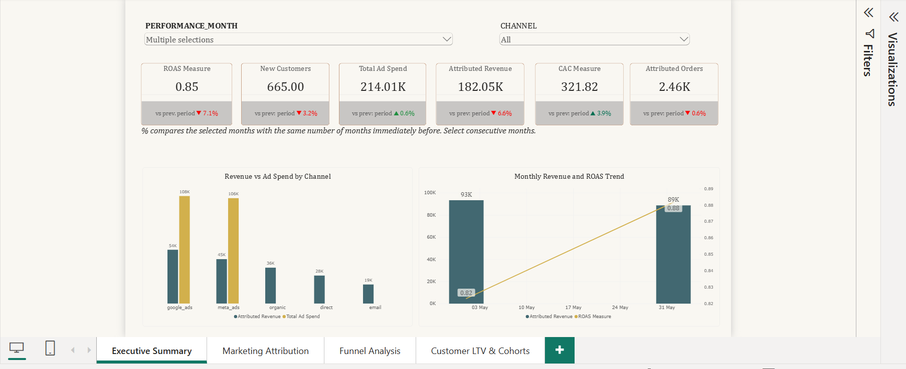
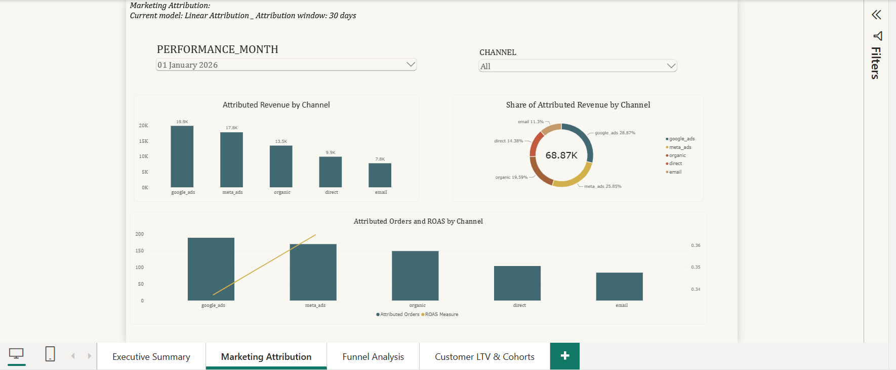
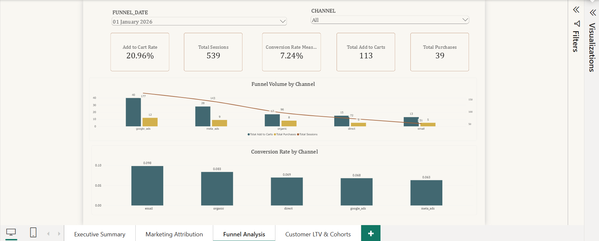

# Power BI Desktop Dashboard

This project includes a completed four-page Power BI Desktop report built on the Snowflake production marts created by dbt.

The report is maintained in Power BI Desktop and is not published to Power BI Service because publishing requires access to an organizational Microsoft tenant.

For portfolio review, the repository versions a copy of the finished `.pbix`, a PDF export, and screenshots. The underlying dataset is synthetic. Power BI binary files are ignored by default, with an explicit exception for this portfolio artifact.

## Portfolio artifacts

The finished dashboard artifacts live in:

```text
docs/power_bi/
├── Northwind_Marketing_Analytics.pbix
├── Northwind_Marketing_Analytics.pdf
├── executive_summary.jpg
├── marketing_attribution.jpg
├── funnel_analysis.jpg
└── customer_ltv.jpg
```

Downloads:

- [Power BI Desktop report (.pbix)](Northwind_Marketing_Analytics%20-%20Copy.pbix)
- [PDF dashboard export](Northwind_Marketing_Analytics-pdf.pdf)

### Executive Summary



### Marketing Attribution



### Funnel Analysis



### Customer LTV & Cohorts


## Data source

Power BI connects to Snowflake with:

```text
Database:  NORTHWIND
Warehouse: TRANSFORM_WH_XS
Role:      TRANSFORMER
Mode:      Import
```

The report uses only analytics-ready production marts:

```text
NORTHWIND.PROD_MARTS.MART_CHANNEL_PERFORMANCE
NORTHWIND.PROD_MARTS.MART_FUNNEL
NORTHWIND.PROD_MARTS.MART_CUSTOMER_LTV
NORTHWIND.PROD_MARTS.FCT_AD_SPEND
```

Raw, staging, intermediate, and monitoring schemas are not used directly by the dashboard.

## Report pages

### 1. Executive Summary

Source: `MART_CHANNEL_PERFORMANCE`

The page contains:

- attributed revenue
- attributed orders
- total ad spend
- new customers
- ROAS
- CAC
- channel slicer
- performance-month slicer
- revenue versus ad spend by channel
- monthly attributed-revenue and ROAS trend

The current synthetic-data export shows approximately:

```text
Attributed Revenue: 527.69K
Attributed Orders:   6.74K
Total Ad Spend:      626.51K
New Customers:       2.00K
ROAS:                0.84
CAC:                 313.26
```

### 2. Marketing Attribution

Source: `MART_CHANNEL_PERFORMANCE`

The current production dbt configuration uses:

```text
Attribution model:  linear
Attribution window: 30 days
```

The page contains:

- attributed revenue by channel
- attributed-revenue share by channel
- attributed orders and ROAS by channel
- channel slicer
- performance-month slicer

The attribution model itself is controlled in `dbt_project.yml`; the dashboard displays the model currently materialized in Snowflake.

### 3. Funnel Analysis

Source: `MART_FUNNEL`

The page contains:

- total sessions
- total add-to-carts
- total purchases
- add-to-cart rate
- conversion rate
- funnel volume by channel
- conversion rate by channel
- channel slicer
- funnel-date slicer

The channel slicer is explicitly bound to:

```text
MART_FUNNEL[CHANNEL]
```

This is important because the imported marts are intentionally not joined together in Power BI. Each page uses slicer fields from the same mart as its measures and visuals.

### 4. Customer LTV & Cohorts

Source: `MART_CUSTOMER_LTV`

The page contains:

- average 90-day LTV
- total customers
- mature customers
- 90-day LTV by cohort month
- average 90-day LTV by acquisition channel
- acquisition-channel slicer
- cohort-month slicer

## Power BI measures

The dashboard recreates the governed business ratios with DAX so they aggregate correctly under report filters.

```DAX
Total Ad Spend =
SUM(MART_CHANNEL_PERFORMANCE[TOTAL_SPEND])
```

```DAX
Attributed Revenue =
SUM(MART_CHANNEL_PERFORMANCE[TOTAL_ATTRIBUTED_REVENUE])
```

```DAX
Attributed Orders =
SUM(MART_CHANNEL_PERFORMANCE[ATTRIBUTED_ORDERS])
```

```DAX
New Customers =
SUM(MART_CHANNEL_PERFORMANCE[NEW_CUSTOMERS])
```

```DAX
ROAS Measure =
DIVIDE(
    [Attributed Revenue],
    [Total Ad Spend]
)
```

```DAX
CAC Measure =
DIVIDE(
    [Total Ad Spend],
    [New Customers]
)
```

Funnel measures:

```DAX
Total Sessions =
SUM(MART_FUNNEL[SESSIONS])
```

```DAX
Total Add to Carts =
SUM(MART_FUNNEL[ADD_TO_CARTS])
```

```DAX
Total Purchases =
SUM(MART_FUNNEL[PURCHASES])
```

```DAX
Conversion Rate Measure =
DIVIDE(
    [Total Purchases],
    [Total Sessions]
)
```

```DAX
Add to Cart Rate =
DIVIDE(
    [Total Add to Carts],
    [Total Sessions]
)
```

Customer LTV measures:

```DAX
Average 90D LTV =
AVERAGE(MART_CUSTOMER_LTV[LTV_90D])
```

```DAX
Total Customers =
DISTINCTCOUNT(MART_CUSTOMER_LTV[CUSTOMER_ID])
```

```DAX
Mature Customers =
CALCULATE(
    DISTINCTCOUNT(MART_CUSTOMER_LTV[CUSTOMER_ID]),
    MART_CUSTOMER_LTV[LTV_STILL_ACCUMULATING] = FALSE()
)
```

## Relationship to the dbt Semantic Layer

The Power BI report currently connects directly to Snowflake `PROD_MARTS`.

The dbt Semantic Layer remains the governed source of metric definitions for:

```text
ad_spend
attributed_revenue
new_customers
roas
cac
sessions
purchases
conversion_rate
average_90d_ltv
```

The Power BI DAX calculations mirror those definitions where equivalent calculations are required in the report.

This keeps the architecture explicit:

```text
Snowflake RAW
    ↓
dbt staging
    ↓
dbt intermediate
    ↓
dbt marts
   ↙      ↘
MetricFlow  Power BI Desktop
```

## Dashboard validation

The final report was validated by:

1. confirming all four pages render correctly,
2. verifying date and channel slicers,
3. confirming the Funnel Analysis channel slicer uses `MART_FUNNEL[CHANNEL]`,
4. checking KPI measures against the underlying marts,
5. exporting all report pages to PDF for a static portfolio review,
6. keeping the finished `.pbix`, PDF, and screenshots together as portfolio artifacts.

## Security and repository policy

Never commit credentials or secrets:

```text
Snowflake passwords
private RSA keys
private-key passphrases
dbt Cloud tokens
Semantic Layer service tokens
```

Power BI `.pbix` files are ignored by default because Import mode can cache data. This repository makes one explicit exception for `docs/power_bi/Northwind_Marketing_Analytics.pbix` because it is a portfolio artifact built from synthetic project data.
